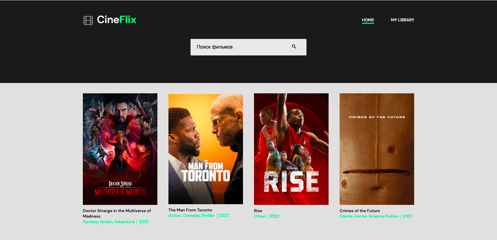
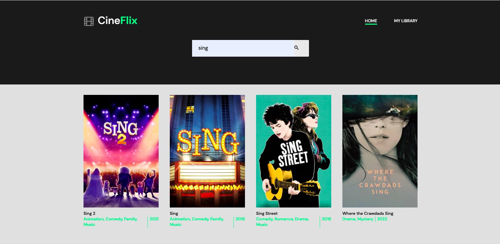
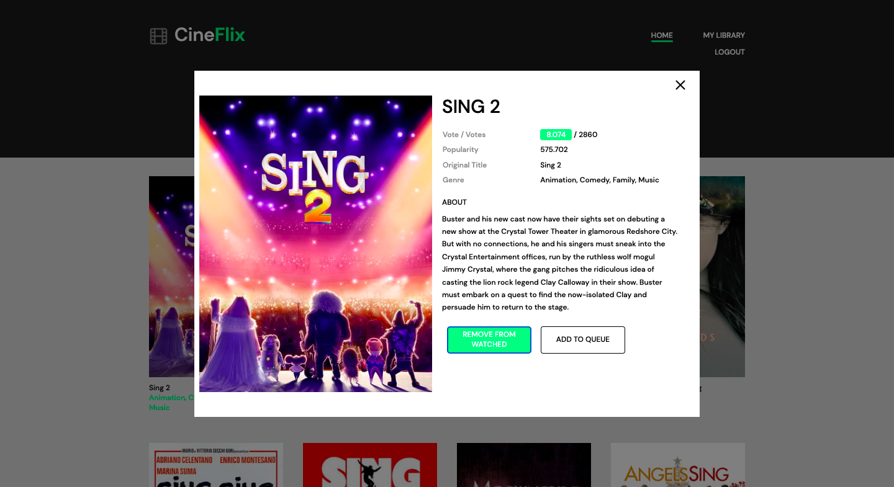
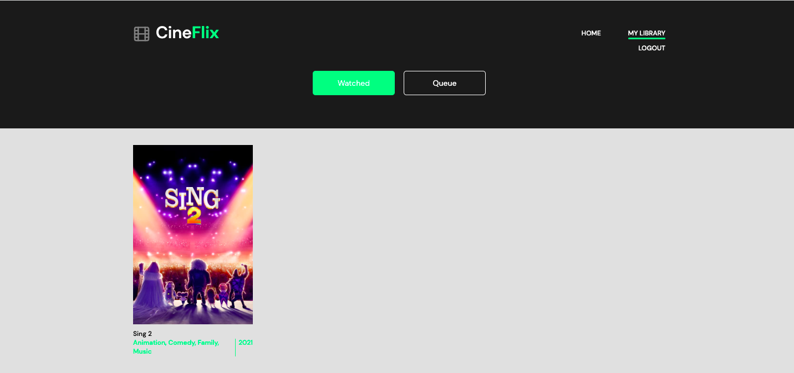

# Parcel template

This project was created using Parcel. For familiarity and customization
additional features [refer to the documentation](https://parceljs.org/).

## Description
A movie catalog using the movie database API.
The goal was to create a catalog using the most important features of the API and create your own design, inspired by other popular movie catalogs.

## Items Used
- ```Front-end```:white_check_mark:
- ```Back-end```:white_check_mark:
- ```Utilites```:white_check_mark:

## Todos
- ```Quick movie search```:black_square_button:
- ```Your own movie library```:black_square_button:

## Images 






